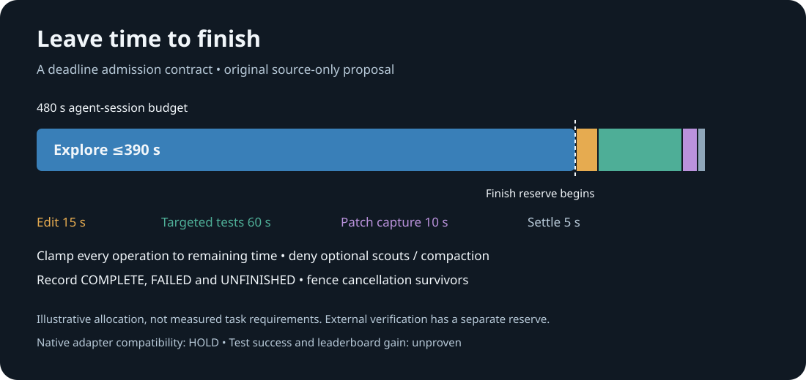

# Leave time to finish

An original, standalone deadline contract for an agent that must still edit,
run targeted tests, and capture its patch before its own time budget expires.
It does not call a model, execute a shell command, contact an API, restore a
repository, or modify a notebook. It is an offline building block for a future
reviewed adapter, not a qualified Gemma submission.



## The concrete gap

The prepared D_v4 calibration packet has an eight-minute agent budget, 28 tool
calls, 80 turns and a 240-second command timeout. Its wire proxy bounds transport
by a 420-second cap and the overall pilot deadline. That does not reserve time
inside the agent's 480 seconds. The pinned official runner uses a full-session
`asyncio.timeout`, while `run_command` clamps to remaining agent time with a
five-second minimum. A command with under five seconds left can therefore ask
for more time than remains. Exact source hashes and line references are in
[SOURCE_OBSERVATIONS.json](SOURCE_OBSERVATIONS.json).

This concerns the **agent's own finishing work**. External final verification
already has a separate allowance: the prepared 825-second arm consists of 48
setup + 480 agent + 240 verification + 57 margin seconds. The evaluator can
return early for an agent error with an empty patch, so external verification
reserve alone cannot recover a patch the agent never captured.

## How the contract works

`DeadlineContract` uses an injected monotonic clock and permits one active
operation. Model calls, ordinary commands, scouts and compaction share the
exploration window. Each accepted operation receives a timeout no larger than
its requested cap or its available window. There is no near-deadline timeout
floor. Once the exploration window is consumed, optional work is denied.

The illustrative default finish reserve is 90 seconds: final edit 15, targeted
agent tests 60, final patch capture 10, and settlement margin 5. These allocations
are a **design choice**, not measured task requirements. Each final stage retains
all downstream allocations. `begin_finish()` can stop exploration earlier.
Changing these figures requires a paired native evaluation; this package does
not assert that 90 seconds improves solved-task counts.

```python
from deadline_contract import DeadlineContract, Kind

contract = DeadlineContract()  # start exactly at the agent-session boundary

# A reviewed async adapter must enforce timeout and honor cancellation.
# This package supplies no live adapter.
result = await contract.run(Kind.MODEL, 420, reviewed_async_model_adapter)

contract.begin_finish()
await contract.run(Kind.FINAL_EDIT, 15, reviewed_async_edit_adapter)
await contract.run(Kind.FINAL_TEST, 60, reviewed_async_targeted_test_adapter)
await contract.run(Kind.FINAL_CAPTURE, 10, reviewed_async_capture_adapter)

# This fixed-vocabulary aggregate contains no callback result or exception text.
public_timing = contract.aggregate()
```

A completed callback is an **execution receipt**, not evidence of a correct
patch or passing tests. Raw return values remain in `Outcome.value` and must not
be published. For example, a test command returning exit code 1 still completed
as an operation; a separate evaluator must record that it failed scientifically.
The aggregate always leaves native test success and official score unset, with
quality promotion `UNPROVEN` and native compatibility `HOLD_UNVERIFIED`.

## Cancellation and compatibility

`run` waits only for its accepted timeout, asks an unfinished task to cancel,
and bounds the cancellation grace. Admission charges that grace before starting
the operation, so a cancellation that settles within its budget retains the
whole downstream reserve. An overrun beyond that allowance remains HOLD.
Timeouts remain `UNFINISHED`, even if the
callback later finishes. A cancellation survivor, clock regression, late return,
or failed final stage fences further admission with HOLD. Exceptions from a
callback are recorded as `FAILED` without copying messages into the aggregate.
Calls rejected at admission are never invoked.

This wrapper cannot preempt synchronous blocking code, a stalled event loop,
or detached work outside the coroutine. A callback must return an awaitable
without doing blocking work during creation. A real adapter must clamp its
HTTP/command timeout from the provided cap, release sockets, and prove process
or backend cancellation under an owned supervisor. Unknown cancellation
semantics remain HOLD. Neither this package nor its tests provide that native
compatibility proof; no global monkeypatch or official evaluator change is
included. An early timeout is not a license to delete, reset, rename, or replace
any notebook, source directory or identity metadata.

## Reproduce the offline checks

Python 3.11+ and the standard library are sufficient. Run from this directory:

```bash
python3 -B -m unittest -v test_deadline_contract
python3 -B -O -m unittest -v test_deadline_contract
```

Tests inject time rather than wait minutes, including cancellation settlement
at the exploration boundary. They cover the final-stage allocation,
near-deadline commands, denied scouts and compaction, blocked async calls,
cancellation survivors, failure and censored denominators, clock regression,
private callback outputs, and validation under optimized Python. No model,
network, billed job or repository mutation is involved.

`deadline-reserve.svg` is an original explanatory diagram of the chosen contract.
It is not a scientific chart of native results. `TEST_RECEIPT.json` binds the
executed checks to exact source hashes. A separate independent review identifies
remaining limitations. The publication allowlist contains only original code,
documentation and safe aggregate evidence; no competitor prompts, task text,
patch contents, task identifiers or credentials are included.

## Provenance

All included implementation and artwork were written independently for this
package. The source observations refer to the organizer's local pinned harness
and the prepared calibration packet. The competition context is
[Gemma 4 Developer Agent on Kaggle](https://www.kaggle.com/competitions/gemma-4-developer-agent).
No public notebook prompt or implementation is copied here. The prior native
budget auditor explains measured elapsed-time failures; this contract is a new
admission mechanism, and neither artifact claims an official score gain.

MIT license. Publication and any future native integration require the existing
campaign coordinator's review and preservation gates.
