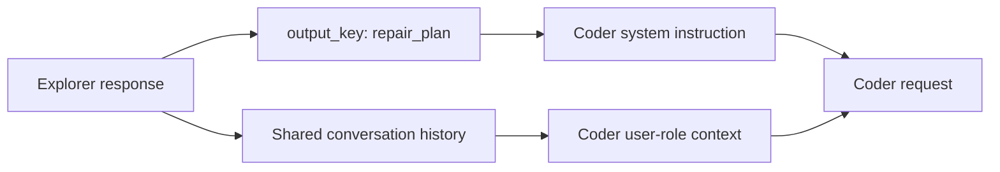

# Where a sequential agent gets its plan

This small CPU experiment runs the organizer's real submission compiler and Google ADK with scripted text responses. It gives you a reproducible way to inspect configuration support, state substitution, conversation history and shared budget APIs before spending model compute.

The experiment passed in 2.434 seconds with five scripted calls across three cases. The recorded receipt contains every request sent to the scripted models. Real model quality, sandbox commands and full evaluator enforcement remain untested.



The second path matters. In the installed ADK 1.36.1, `LlmAgent` uses `include_contents: default`. Other agents' messages enter the coder request as attributed user-role text. The explorer's plan reaches the coder through this history even when the optional state placeholder is empty.

| Case | State placeholder | Coder history | Observed behavior |
| --- | --- | --- | --- |
| `present_state` | Exact plan, including Unicode and newline | Same plan | Coder runs |
| `optional_absent_state` | Empty | Same plan | Coder runs |
| `required_absent_state` | Missing required key | Coder request never constructed | Expected `KeyError` |

The missing-state case verifies optional template handling. Its shared history prevents a causal comparison of plan availability or handoff quality. The scripted coder also emits a fixed answer independently of its input, so these cases cannot measure repair success.

## Run it

Use Python 3.12 on POSIX with Google ADK 1.36.1, Google GenAI 2.11.0 and the organizer SDK's dependencies already available. Supply the licensed organizer source tree. Exact source hashes are checked before execution; no SDK code or model assets are bundled here.

```bash
PYTHONDONTWRITEBYTECODE=1 python check_sequential_portable.py \
  --sdk-root /licensed/organizer/src \
  --output-dir /new/local/sequential-check
```

The output directory must be new. The program records its protocol before running, rejects IP network calls, uses a 90-second process limit and preserves all source inputs. See `--help` for the optional ADK environment path.

The original [protocol](../../experiments/2026-10-04-sequential-handoff/protocol.json) and [receipt](../../experiments/2026-10-04-sequential-handoff/receipt.json) remain unchanged. The [history interpretation](../../experiments/2026-10-04-sequential-handoff/shared-history-interpretation.json) binds the observed request contents to those exact files and the installed ADK sources.

## What a future comparison needs

A quality experiment should declare whether it changes the schedule, state insertion, shared transcript or the parent summary call. Holding the model, tools, task panel and total budgets fixed makes the result interpretable. Information exposure needs separate inspection: setting `include_contents: none` still includes current-turn context in this ADK version, so that setting alone does not establish an isolated handoff.

The sequential idea was studied from [hsiaosuan's Version 2](https://www.kaggle.com/code/hsiaosuan/gemma-developer-agent-0-13-submission?scriptVersionId=355057602), whose verified best badge was **0.10**. The fixture is independently written; attribution and hashes are in [provenance.json](provenance.json). The public score belongs to that notebook, and gives this fixture no measured solve rate.
