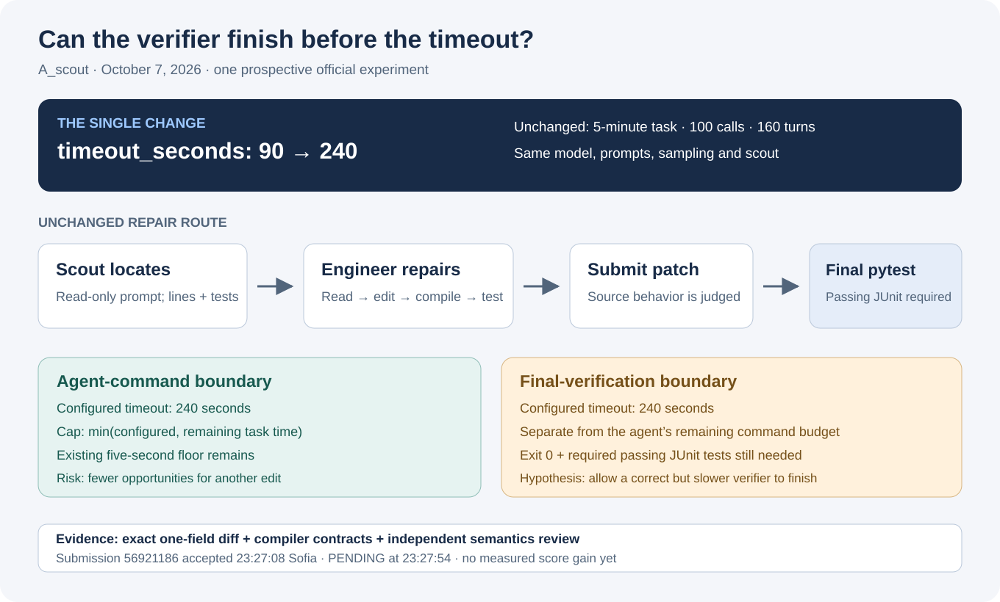

# Does a longer command timeout help a five-minute repair agent?

This experiment keeps our **A_scout** agent intact and changes one setting: `evaluation.timeout_seconds`, **90 → 240 seconds**. Kaggle accepted submission **56921186** on **October 7, 2026, at 23:27:08 Sofia time**. Its last recorded state in this packet is **PENDING**, observed at 23:27:54. There is no score for this variant yet.

The test belongs to the [Gemma 4 Developer Agent competition](https://www.kaggle.com/competitions/gemma-4-developer-agent). The account is `prvsiyan`; this repository is the public experiment record. These six files form a submission bundle. No Kaggle notebook was pushed, renamed or otherwise mutated for this attempt.



## Why test this?

An agent can make a plausible repair and still lose the result when a long command or the final verification times out. Increasing a command timeout gives those operations room to finish. It also risks spending most of the same five-minute task budget on an unproductive command. This experiment tests that tradeoff through one official evaluation; it does not assume that a longer timeout improves reasoning.

The baseline asks a scout to locate the relevant source and nearby tests, then asks the engineer to read the lines, edit source, compile the changed files, test the behavior and submit its patch. The scout prompt asks it to remain read-only; that is an instruction, not a claim of an isolated filesystem permission boundary. The model, tools, scout, prompts, sampling and route are unchanged here.

| Setting | Baseline | Candidate |
|---|---:|---:|
| Command / final verification timeout | 90 s | 240 s |
| Task time budget | 5 min | 5 min |
| Tool-call cap | 100 | 100 |
| Turn cap | 160 | 160 |
| Model | `gemma-4-31b-it-qat-w4a16-ct` | Same |
| Submitted files | 6 | 6 |

Only `eval_config.yaml` differs. The other five archive members are byte-identical. Both exact member manifests and archive identities are in [artifact_manifest.json](artifact_manifest.json).

## What the timeout actually changes

Our independent review traced the setting through the locally staged official harness source and checked that the five distinct files reviewed match the recorded `swegemma-0.2.7` wheel. The reviewed behavior is:

- The flat `timeout_seconds` field becomes the harness command timeout.
- An agent command uses the smaller of that configured timeout and the remaining task time, retaining the harness’s existing five-second floor. A 240-second setting cannot generally give a late command four extra minutes.
- The code executor uses the same configured limit, and the initial harness instructions tell the agent the new single-command timeout.
- Final grader `pytest` also uses this timeout, independently of the agent’s remaining command budget. Passing still requires exit code zero and a valid, nonempty, passing JUnit report with the required tests.

The source review and six mocked exact-function probes establish configuration semantics. They do not measure how often real tasks need 91–240 seconds or whether the candidate solves more of them. See [validation_summary.json](validation_summary.json) for the source hashes, boundaries and probe cases. Official source and model weights are not redistributed here.

## What we verified before submitting

Seven existing package/official-compiler contract tests passed under Python’s normal mode and again under `-O`: layout and size; deterministic archive/directory equality; model, tools and sampling declarations; prompt placeholders and length; evaluation configuration; compilation with the local official compiler; and literal braces during instruction templating. The independent review confirmed the exact one-field change.

Those seven tests were repeated in two interpreter modes; they are not fourteen independent experiments. The existing nominal twelve-hour runtime test excludes final verification and is not proof of current official batch duration. No local model run or solve-rate validation was performed for this variant before submission.

## Rebuild the exact candidate or baseline

From this directory, with Python 3.12 and its standard library:

```bash
python3 rebuild_bundle.py
python3 rebuild_bundle.py --variant baseline
```

These commands reconstruct the archives in memory, check every member and the full SHA256, and print an identity report. They do not upload anything or run a model. The verified environment was **Python 3.12.14 / zlib 1.2.12**; a different compressor version may produce different archive bytes and the utility will refuse that mismatch.

To write a new ZIP without overwriting an existing path:

```bash
python3 rebuild_bundle.py --output /tmp/gemma-timeout240-new.zip
```

| Archive | SHA256 |
|---|---|
| Candidate | `1ebbb3e76e2dc2577436f2e52a31f667f750bc26f9139f7fb10098db710808b9` |
| A_scout baseline | `d43f47063a4df557325d3e9e3cf28fddeb00ddbbcd49150e50a200d50a52d6fa` |

The baseline is reconstructed from the five unchanged candidate members plus [its original evaluation configuration](baseline/eval_config.yaml). The submitted candidate is 3,729 bytes. This utility rebuilds the bundle; running it in the competition still requires the official harness, supported model and applicable access/terms.

## Acceptance, scores and interpretation

The completely paginated account listing before submission showed the same A_scout baseline archive at **0.08** in completed row **56794711** and **0.06** in completed repeat **56859742**. Those are two official draws of that baseline, not two architectures. The account’s best completed score at the pre-submit check was 0.08. This candidate’s score remains unknown in the accepted-row snapshot.

During this attempt, `competition_submit` returned before the local receipt writer raised an `AttributeError`: it attempted to read an `error` field absent from the SDK response. We did **not** upload or submit again. A read-only, fully paginated listing recovered exactly one matching row, **56921186**, and the upload copy’s SHA256 matched the qualified candidate. This was a client logging failure after an accepted submission, not evidence that Kaggle evaluation failed. The sanitized [acceptance recovery receipt](acceptance_recovery.json) records the distinction.

Read [the official snapshot](official_submission_snapshot.json) for the exact accepted timestamp, state and baseline rows. This packet is an immutable observation of the pending attempt; a later completed result should be documented as a separate observation rather than silently changing this record. One candidate draw compared with historical draws will not isolate a causal effect from evaluation variability. More paired development work and completed official evidence are needed before calling this an improvement.

The packet’s original material is available under [MIT](LICENSE). Model and official harness terms remain separate.
