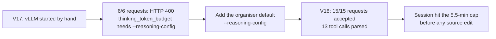

# One missing server flag, then a working reasoning route

Two private one-task canaries ran our direct Gemma agent (`D_budgetfit55` v2: reasoning on with a 4,096-token budget, output
8,192, 28 calls, 5.5 minutes) on the competition's own runtime: vLLM 0.19.1 on four L4s and the organiser compiler and harness.
They were checks of the route, not of quality. One public task (`rich_3772`, chosen before any outcome) cannot measure a solve rate.

V17 failed because our hand-written server command omitted `--reasoning-config`. vLLM refuses `thinking_token_budget` without
it. The organiser launcher adds `{"reasoning_start_str": "<|channel>", "reasoning_end_str": "<channel|>"}` automatically for the
gemma4 reasoning parser, so official scoring was never affected. V18 added exactly that default. It also set compaction to the
documented 5/2/14,336/5 and moved the runtime environment out of the saved output.

| V18 measurement | Value |
|---|---|
| Weight hash (23.27 GB) / model ready | 179 s / 500 s after the first cell |
| Requests with reasoning on, budget 4096 | 15 of 15; zero rejected |
| Tool calls parsed and executed | 13; none malformed; one compaction at 15,530 prompt tokens |
| Request time | median 7.2 s, p90 45 s, max 120 s (eager decode ≈ 12 tokens/s) |
| Reasoning per turn | 30–570 characters typical, 4,842 maximum; budget never reached |
| Outcome | 5.5-minute cap reached with an empty patch, so no final test ran |

Three long generations took 224 of the 332 seconds. The largest was a reproduction script written with `write_file` into `/tmp`,
which the harness refuses outside the repository. The next candidate therefore changes the prompt and the time cap. That makes it
a new bundled hypothesis, not a measured fix.

`GATE_RESULT.json` and `TIMINGS.json` hold the reduced receipts: statuses, timings, token counts, tool names and reasoning
lengths. They contain no prompt, task text, tool argument or model output. Eager decoding and a 512-token batch make these
timings upper bounds for the official runtime. No official score follows from either canary.
