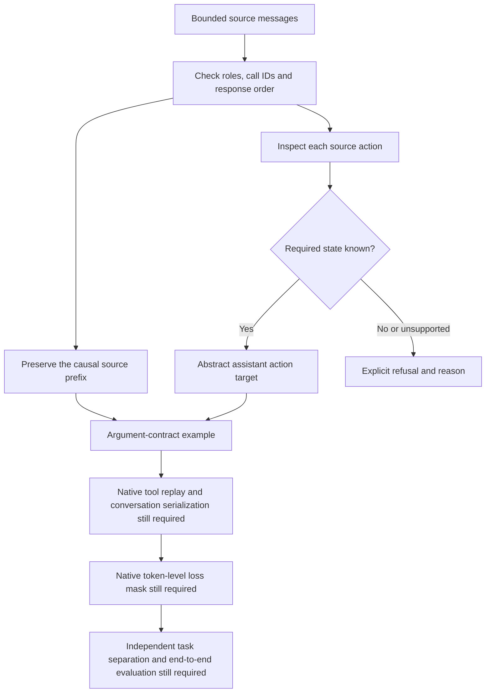

# Can this tool call actually transfer?

A source trajectory can look like a ready-made training example while describing a different workspace, editor and conversation format. This component checks a narrower question: **can we preserve the arguments of this particular action without guessing missing state?**

It is an original, standard-library-only converter for a bounded SWE-smith message stream. Accepted actions become abstract assistant targets. Source observations stay in their original format. Every result explicitly reports `training_ready: false`.

The component does not execute commands, replay tools, tokenize conversations, load a model or train one. There is no official score or measured agent improvement associated with it.

## Run the public checks

Python 3.9 or newer is sufficient. From the repository root:

```sh
python3 -m unittest discover \
  -s experiments/trajectory-contracts/2026-10-05/reviewed_v4 \
  -p test_trajectory_converter.py -v
```

There are 30 synthetic semantic tests and one optional frozen-row test. The optional test explicitly skips when the privately retained source response is absent. The public test file differs from the reviewed private V4 only by that skip guard; the converter itself is byte-for-byte V4. Exact hashes and the observed public test result are recorded in `VALIDATION.json`.

## What the converter preserves



| Source action | Abstract target | Required evidence |
| --- | --- | --- |
| `str_replace_editor` / `view` | `read_file` | A supported lexical workspace path and valid inclusive line range. Source output formatting is not converted. |
| `str_replace_editor` / `create` | `write_file` | Caller-supplied proof that the file was absent before this action. |
| `str_replace_editor` / `str_replace` | `edit_file` | The complete current file and exactly one match for the old string. |
| `bash` | `run_command` | A narrow explicit root-directory command with one reviewed argument vector and no shell expansion. This is an argument mapping, not an execution sandbox. |
| `submit` | `submit_patch` | No arguments. |

Missing state is different from a negative fact. An omitted path means unknown; `{ "pkg/a.py": null }` means the caller has supplied evidence of absence. A later success message cannot justify an earlier action's precondition. Path checks are lexical and do not attest symlinks, file types or actual workspace containment.

For example, from the component directory:

```python
from trajectory_converter import Refusal, transfer_call

view = transfer_call(
    "str_replace_editor",
    {"command": "view", "path": "/testbed/pkg/a.py", "view_range": [3, -1]},
)
assert view == {
    "name": "read_file",
    "arguments": {"filepath": "pkg/a.py", "start_line": 3, "end_line": None},
}

try:
    transfer_call(
        "str_replace_editor",
        {"command": "create", "path": "pkg/a.py", "file_text": "answer = 42\n"},
    )
except Refusal as error:
    assert error.reason == "create_absence_unproven"
```

## What we observed on one public trajectory

The privately retained diagnostic used one APISpec trajectory from [SWE-bench/SWE-smith-trajectories, revision `08e109b4`](https://huggingface.co/datasets/SWE-bench/SWE-smith-trajectories/tree/08e109b4a59eaeebf80e4675cd125d42e7ac99a4). It contained 21 assistant turns: 11 passed argument conversion and 10 were refused. The refusals were five unsupported command-directory/path forms, four unproven file absences and one unproven current-file state.

These are data-contract counts, not usable native training-example counts or task-success measurements. All accepted targets still lack verified native observation replay and native token supervision. The result was not selected from a trajectory sweep and does not estimate general conversion coverage.

The source teacher was `claude-3-7-sonnet-20250219`. Only the public dataset row was accessed; no teacher service was called. Its source-reported `resolved: true` describes that teacher trajectory and does not measure this converter or a Gemma agent. The raw trajectory, source observations and solution patch are not included in this package. Public provenance identifiers and response hashes are in `source_provenance.json`.

## Why training stays blocked

The upstream repository commit identifies clean APISpec source. The teacher task is a synthetic broken-state instance; replay also needs the exact bug-introducing task state and a reproducible environment. A solution patch and a clean checkout are insufficient.

The source conversation uses SWE-smith response fields and tool formatting. Argument correspondence alone does not make those observations native. Assistant text is deduplicated when `thought` and `content` agree, but that is not a decision about Gemma's reasoning channel or its position relative to tool calls. The target template, control tokens, complete assistant turns and tool-response exclusion must be validated before assigning token labels. Silent aliasing, substring-based label boundaries and invented file-state evidence would turn a passing format check into misleading supervision.

A real training experiment would therefore need native tool replay from the exact broken task state, verified causal observations, an explicit reasoning policy, native conversation rendering and a measured token mask, then task-level separation and full episode evaluation against a fixed control. This package supplies the argument-contract component only.

## Attribution and reuse

The converter, synthetic tests and documentation are original campaign work, offered under the component's MIT license. They adapt independently checked tool-argument contracts rather than copying a competing agent.

The diagnostic refers to the public SWE-smith trajectory dataset and [APISpec's pinned MIT notice](https://github.com/marshmallow-code/apispec/blob/8b421526ea1015046de42599dd93da6a3473fe44/LICENSE), included as `upstream_MIT_NOTICE.txt`. That notice covers APISpec software; it does not certify every mixed-origin excerpt in a trajectory or license any model weights. No trajectory contents, model assets or competition data are redistributed here.

This component supports the [Gemma 4 Developer Agent campaign](https://www.kaggle.com/competitions/gemma-4-developer-agent). Its validation status should be read independently of any competition submission.
