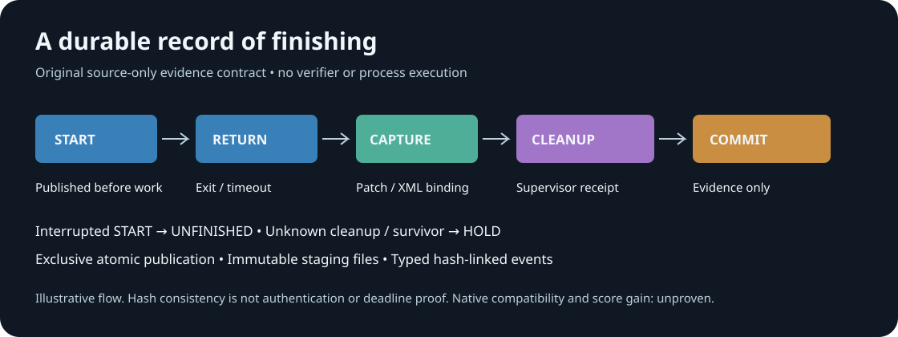

# A durable record of finishing

An original source-only finalization journal for verification that may be
interrupted. It does not execute tests, models, commands or APIs, stop processes,
restore workspaces, or change the prepared competition candidate.



The prepared V21r6/D_v4 capture helper creates its verification-start event in
memory, then writes the event after execution and XML capture. Its exclusive
JSON/blob writes preserve existing files but can leave a partial named artifact
if interrupted. The supervisor already enforces the 825-second arm and checks
owned-process survivors. This package adds a distinct **durable evidence
boundary**; it does not replace that supervisor or its separate 240-second
external verification allowance. Exact local source bindings are in
[SOURCE_OBSERVATIONS.json](SOURCE_OBSERVATIONS.json).

## The record

A new `finalize-evidence-*` directory has one writer and one verifier attempt.
Each event is written to a new staging file, flushed and fsynced, then published
with an exclusive same-directory hardlink and a directory fsync. Event names are
never replaced. Staging files remain permanently; there is no delete, rename or
cleanup path. Every canonical event names its predecessor's SHA256.

`START` must publish before the caller can invoke its reviewed verifier adapter.
If the arm then stops, the reader reports `UNFINISHED`. A failed publication
returns no admission ticket and fences the writer. A partial unpublished staging
file is counted rather than mistaken for a completed event.

`RETURN` records exit, timeout and late-return observations before hashing XML.
`CAPTURE` binds patch size/hash and the three XML observations: retained report,
actual cat output, and original strict-validator input. Zero-exit capture requires
matching nonempty XML. A nonzero pytest exit legitimately skips cat/validation;
its nonempty retained XML can still be a completed **negative capture**. Neither
exit zero nor XML capture alone establishes passing tests. The supplied strict
validator result remains a separate observation.

`CLEANUP` must come from the final owned supervisor receipt. A command's exit
or SIGKILL attempt does not prove that all descendants stopped. Unverified cleanup,
unknown survivor count, or any survivor leaves `HOLD`. `COMMITTED_CAPTURE` means
that a consistent capture record and clear cleanup observation were committed.
It does not mean a correct patch, a native-compatible adapter, deadline-qualified
execution, or an official score.

## Deadline contract and its limits

`begin` chooses an upper timeout bound from the actual remaining monotonic time,
retaining a configurable capture reserve. Its `START` field is explicitly the
**planned pre-write upper bound**. Because durable writing takes time, the
returned ticket cap is recomputed after publication. Call `command_timeout(ticket)`
immediately before starting a command; it rechecks remaining time and refuses
an exhausted window. The reviewed adapter must apply that cap to every owned
subprocess operation, including a later cat/inspection call. This observer does
not execute or preempt any subprocess itself.

Capture checks the absolute deadline before and after bounded hashing. A late
commit write is revoked with an `ABORT` event when control returns. A blocked
filesystem call cannot be preempted here: the process might be interrupted after
publishing `COMMIT` but before publishing revocation. Therefore a journal alone
cannot prove post-fsync deadline compliance. The fresh, trusted outer watchdog's
elapsed-time, owned-survivor and preservation receipts remain mandatory before
any native qualification. All projected native compatibility remains
`HOLD_UNVERIFIED`; native test success and official score remain unset.

A self-consistent unkeyed hash chain detects incomplete or inconsistent records;
it is **not authentication**. Patch hashes, validator results and cleanup values
are adapter-supplied observations. A caller that invents those observations can
make a structurally consistent journal. Native integration must bind them to the
actual original calls and exact supervisor receipt, rather than trust a JSON
field or fixture.

The reader caps directory inventory, event count and event bytes, checks exact
typed schemas and legal stage order, derives capture/cleanup consistency, and
emits only fixed status values. An isolated `COMMIT`, arbitrary extra fields,
symlinks, partial JSON or hash-chain drift are rejected. It never publishes XML,
exception messages, paths, task identities or model outputs.

## Offline use

```python
from finalization_journal import FinalizationJournal, inspect_journal

journal = FinalizationJournal(
    new_evidence_directory,  # new finalize-evidence-* leaf
    absolute_deadline=reviewed_absolute_monotonic_deadline,
)
ticket = journal.begin(240)
if ticket is not None:
    cap = journal.command_timeout(ticket)
    # Only a separately reviewed adapter may now run the original verification.
    # Build Observation from the actual original exit/patch/XML/validator evidence.
    # journal.returned(ticket, actual_observation)
    # journal.close(cleanup_verified=actual_clearance, survivor_count=actual_count)

safe_aggregate = inspect_journal(journal.path)
```

The commented integration is deliberately unimplemented. There is no live
adapter, candidate update, global monkeypatch or task runner in this package.
No notebook, source directory or identity metadata is removed or renamed.

Python 3.11+, standard library:

```bash
nice -n 5 python3 -B -m unittest -v test_finalization_journal
nice -n 5 python3 -B -O -m unittest -v test_finalization_journal
```

The invented controls cover durable start, interruption, publication/fsync
failure, no overwrite, shrinking deadline, mismatched or missing XML, negative
pytest outcomes, strict-validator failure, unknown cleanup and survivors,
forged terminal events, type/schema/sequence checks, directory caps and late
commit revocation. Test artifacts remain preserved and are excluded from the
public allowlist. No native test, model or network call is involved.

## Before integration

- Bind the exact candidate, original verification/command/capture source hashes,
  and current supervisor protocol; the source packet's existence is no launch.
- Prove cap propagation to every owned subprocess and release/reap behavior under
  an independently supervised timeout. Preserve all notebooks and snapshots.
- Bind XML and strict validation to actual original invocations; verify patch
  identity and the separate cleanup/elapsed-time/preservation receipts.
- Test same-filesystem hardlink publication and file/directory fsync semantics on
  the actual filesystem. A storage stall requires the external arm supervisor.
- Keep failed and interrupted attempts in the denominator. Run a paired native
  evaluation before claiming compatibility, task-quality or score improvement.

The SVG is original explanatory artwork, not a chart of measured native results.
The code is independently written, MIT licensed. No organizer implementation or
competitor prompt is included. Competition context:
[Gemma 4 Developer Agent](https://www.kaggle.com/competitions/gemma-4-developer-agent).
