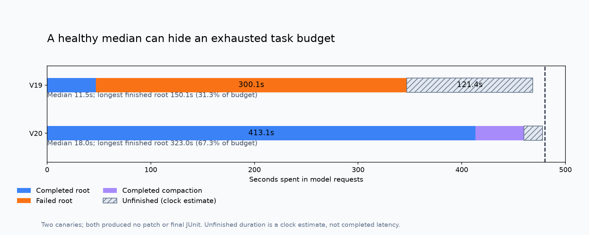

# When a fast median produces no patch

The original `native_budget_audit.py` makes Gemma canary failures comparable without publishing the issue, repository, model prompts, patches, tool arguments, raw test output, or private artifact paths. It performs no network requests, model execution, task restoration, or input mutations. Outputs are new ordinary JSON files; existing files are never overwritten.

The two measured canaries below use the same 480-second active task cap. Both preserved their notebooks and cleaned their owned processes. Neither produced a patch, a final pytest invocation, or a JUnit read. These are native execution observations, not official scores or quality estimates.

| Measurement | V19 | V20 |
|---|---:|---:|
| Completed root requests | 4 | 7 |
| Failed root requests | 2 | 0 |
| Unfinished root requests | 1 | 1 |
| Completed-root median | 11.47 s | 18.03 s |
| Longest finished root request | 150.09 s | 323.00 s |
| Longest request / task budget | 31.3% | 67.3% |
| Finished model-request time, all classes | 346.99 s | 459.78 s |
| Completed compaction time | 0 s | 46.69 s |
| Finished model-request time / task budget | 72.3% | 95.8% |
| Patch characters | 0 | 0 |



V19's successful-request median excludes 300.10 seconds spent on two failed requests. V20 removes that transport failure, but one successful turn occupies over two thirds of the task budget. Its short median therefore does not establish that the agent has enough time to edit and verify. Raising the notebook timeout alone does not enlarge the separate 480-second agent budget.

The raw usage records completion tokens, without a separate reasoning-token or cap-hit field. The auditor leaves reasoning-cap usage unknown. A completion-token threshold is not relabeled a measured reasoning-cap rate. It reports an illustrative decode-time projection separately as an inference, with no prediction about quality.

An unfinished request remains in the request denominator. Its displayed time is an estimate from the arm start timestamp and task duration. Finished request time is the measured lower bound on model time; the unfinished estimate is never presented as completed latency or an exact lower bound.

## Use on a newly completed canary

Supply the native wire ledger, one task-result JSONL row, matching arm receipt, final verification receipt and outer watchdog receipt. The arm must bind the verification receipt SHA256. Required task identities and counters must be present, clocks must agree, and overlapping requests are rejected rather than double counted.

```bash
python -B native_budget_audit.py \
  --ledger /path/to/PRIVATE_WIRE_LEDGER.json \
  --task /path/to/task_results.jsonl \
  --arm /path/to/PRIVATE_NATIVE_ARM_RECEIPT.json \
  --verification /path/to/PRIVATE_VERIFICATION_CAPTURE_RECEIPT.json \
  --watchdog /path/to/PRIVATE_OUTER_WATCHDOG_RECEIPT.json \
  --budget-seconds 480 \
  --output /path/to/new-aggregate.json
```

The output separates native execution/capture completeness, native test success, and official score. Execution and capture can be complete even when an ordinary task test fails; `native_tests_passed` reports that independently. A successful tool return alone cannot establish a successful edit. Even a fully completed canary does not prove a strategy gain or qualify an official score.

The figure renderer is a reproducible illustration of these specific V19/V20 projections, with SVG output using the standard library and optional PNG output using matplotlib:

```bash
python -B render_budget_figure.py \
  --earlier V19_AGGREGATE_V3.json --later V20_AGGREGATE_V3.json \
  --output /path/to/new-figure.svg --png-output /path/to/new-figure.png
python -B -m unittest discover -s . -p 'test_native_budget_audit.py' -v
```

Twenty-one adversarial tests cover private-string omission, failed and censored denominators, compaction, invalid clocks, missing identities, missing counters, booleans masquerading as numeric fields, absent JUnit, and the distinction between execution and task success. Normal and optimized Python modes both passed. These tests validate the offline evidence projector, not the model.

## Public research checked on 9 October 2026

The competition's score-sorted code page still lists [Budget-Fit Single Agent V5](https://www.kaggle.com/code/verracodeguacas/gemma-4-agent-budget-fit-single-agent?scriptVersionId=355310852) at 0.18. Its visible license is Apache-2.0. It combines thinking enabled, an 8192-token output cap, an eight-minute active cap, 28 charged tool calls and targeted testing. Those mechanisms already appear in our prepared D v4; another copy of the same configuration adds no evidence.

[SuperAgent's scored V5](https://www.kaggle.com/code/matterhorn3838/gemma-4-superagent?scriptVersionId=355922587) displays 0.17 and Apache-2.0. Its latest V8 has different prompt text. The best-score badge is attached to V5, so V8's changes cannot be credited with that score. The rendered V5 uses the same visible configuration and prompt family as Budget-Fit; this observation is not a new byte-level archive comparison.

[Yiyu's scored V1](https://www.kaggle.com/code/yiyu0716/g4-pack-yiyu-v19-fixed-trace-t7p5?scriptVersionId=356344238) displays 0.17 and Apache-2.0. It is a different visible eleven-member package with analyzer/workflow agents and an edit skill. The latest V2 has an error. Its encoded package was visible, but direct public source retrieval returned HTTP 403, so the package's actual member contents were not independently decoded in this work. Do not infer tool efficacy from its filenames or treat its newer failed head as the scored strategy.

[The author's public ablation](https://www.kaggle.com/competitions/gemma-4-developer-agent/discussion/746250) reports larger losses when thinking is disabled than when sampling is changed, noisy repeats, and a quality/runtime tradeoff from reduced call limits. Its Kaggle calibration combines prompt and completion tokens; total-token throughput must not be compared directly with our measured decode-only throughput. The author also distinguishes a local quality sweep from a submission-time budget. These are author-reported observations on another setup, not our paired results.

The practical next step is to audit the already-prepared scorer-aligned V21 canary with the same tool. Record finished, failed and unfinished request counts; first actual patch; final test evidence; compaction cost; and tail concentration before choosing a new model budget. Keep the unchanged D v4 and the already-built lower-budget alternative as explicit separate arms if a quality comparison is run. Do not assume that a faster decode calibration alone demonstrates a better patch.

All code in this package is independently written. No competitor prompt, organizer implementation, model weight, or task content is bundled. References are credited for ideas and observations; their licenses do not extend to unrelated assets.
