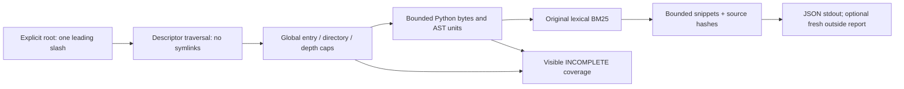

# Offline Python source locator

An original standard-library BM25 implementation over AST module, class,
function and async-function source units. It reads only `.py` files under an
explicit authorized absolute root. It never imports or executes indexed source,
loads models or uses competition data, benchmark labels or submission machinery.



Run with Python 3.10+ on POSIX:

```bash
python3 source_locator.py --repo-root /absolute/path/to/source --query 'parse HTTP response header' --top-k 5
```

Stdout is one JSON object. Exit 0 means indexing completed within the declared
scope; exit 2 means incomplete coverage or an input/read/report error. No report
is written by default, and no index/cache is created in the source root. An
optional `--report /absolute/fresh/path.json` writes exclusively to an existing
parent outside the source root. Existing leaves, symlink parents and paths
beginning with two or more leading slashes are refused. Roots also require one
leading slash and no parent traversal components. This explicitly rejects the
`//path` versus `/path` alias that invalidated v1's outside-root check.
The report parent and its descriptor-opened `..` ancestors are also compared
with the indexed root's captured device/inode identity. A matching physical
ancestor refuses firmlink/mount aliases even when their textual paths differ.
Ancestry must reach the filesystem root within 256 steps; errors or an exhausted
bound refuse the report. Component traversal stays O_NOFOLLOW and the new leaf
is still created with O_EXCL.

The indexed root identity is captured from the actual scan descriptor and
returned in coverage. Before report creation, its textual path is reopened and
must still name that identity; drift is checked before and after ancestry
validation. The API accepts `indexed_root_identity=index.root_identity`, or uses
the capture from a v2 retrieval result. Reports without a capture are refused.
This pins the scanned directory identity, not an entire source checkout.

## Bounds and coverage

Default limits are 100,000 directory entries, 4,096 visited directories and
directory depth 64 (root depth is zero), plus 2,048 Python files, 1 MiB/file,
16 MiB total fully read source bytes and 50,000 AST units. Every directory entry
consumes the global entry budget, including non-Python files, ignored directories
and symlinks. Empty traversed directories consume the visited-directory budget.
Enumeration uses bounded `scandir`, not an unbounded `listdir` collection. Names
collected within the remaining global budget are sorted for deterministic full
scans. Hitting an entry/directory/depth cap reports INCOMPLETE with an explicit
reason, counts and directory event; unscanned source is never claimed complete.

The entry cap is a strict fetch ceiling: once it is reached, even the next EOF
check is refused. A tree with exactly as many entries as the cap may therefore
be conservatively INCOMPLETE. A partially enumerated directory is not indexed;
previously completed directories remain in the report. A capped scan's observed
subset can depend on filesystem enumeration order. Full unchanged scans remain
deterministic.

Traversal caps can be set through the CLI:

```bash
python3 source_locator.py --repo-root /absolute/path/to/source --query 'header parser' --max-entries 50000 --max-directories 2000 --max-depth 32
```

All limits must be positive integers. Other source/query/snippet limits are
configurable through the `Limits` Python API. Query length is at most 4,096
characters, top-k at most 20, and snippets at most 20 lines / 1,200 characters.

Ignored directory names are `.git`, `.hg`, `.svn`, `.venv`, `venv`, `__pycache__`
and `node_modules`. Symlink entries and symlink root components are excluded or
refused. Descriptor source reads use O_NOFOLLOW. Files with no read permission
bits are reported unreadable even if a privileged process could open them;
other OS permission errors are also visible. UTF-8 BOMs are supported. Other
encodings are not guessed. Changes in opened-file metadata during a read are
refused. Decode and parse failures make coverage INCOMPLETE and contribute no
retrieval units; complete raw reads still receive a source hash.

## Ranking and interpretation

BM25 uses k1=1.5 and b=0.75. Declared names receive two extra token occurrences
and relative paths one. ASCII CamelCase and underscores are split; tokens of
one character are ignored. Non-ASCII identifier words are not lexical signals.
Query terms are deduplicated. Equal scores sort by relative file, full unit
span, kind and qualified name. Duplicate declarations and symbols in separate
files remain distinct. Module/class units intentionally overlap child functions.

Snippets center on the first matching source line within the unit. Full original
unit coordinates and raw source SHA256 stay attached to truncated snippets.
Scores rank lexical relevance only: they do not certify patch correctness,
dynamic call resolution, current checkout identity or improved agent scores.

The motivation is the public source-localization audit at
https://github.com/aghasalim/gemma4-code-graph-localization/tree/893a6878f6241a46cd9b95fd0cf78b8dbf49afbd
by Aghasalim Mustafazada, MIT. It motivated independent testing; no public
implementation was copied, and its results are not evidence about this tool's
patch or competition performance. Attribution and byte pins are in provenance.

## Verification and practical limits

Run `python3 -B verify_toy.py`. It creates only a new preserved synthetic fixture
directory next to the verifier and prints a receipt. The 28 checks cover the
original retrieval/AST/hash/fault/coverage behavior and new alias, nonsource-entry,
empty-directory, depth, strict entry-ceiling and CLI regressions. Additional
descriptor-identity mocks cover physical parent/ancestor aliases, unreadable or
too-deep ancestry and root-path identity drift without renaming real inputs.
Source bytes,
modes and trees are compared before/after; the indexed execution sentinel stays
absent. Permission failures are fault-injected without changing input modes.

V1 and its initial failed and corrected fixtures remain intact. V1's initial
13/14 result came from an overbroad query containing `marker`, which correctly
matched an unrelated nested marker. Narrowing that test to excluded-only words
gave 14/14. Independent review subsequently reproduced a separate report-path
alias defect and identified uncapped traversal. This v2 addresses those defects;
it does not erase or reinterpret the earlier receipts.

The first 22-test v2 source snapshot and its fixture also remain preserved.
The current revision adds physical descriptor ancestry and root identity checks
for the broader filesystem-alias case.

This is a bounded-input offline utility, not a hardened parser service. It has
no hard wall-time/heap sandbox or atomic filesystem-transaction guarantee.
Adversarial directory renames after ancestry/root validation can still race
leaf creation; source files and the whole checkout are not locked or snapshotted.
AST/tokenization work can still be expensive within the declared bounds. Use an
expressly authorized, stable source namespace.
There is no private Gemma checkout integration, native model evaluation or
competition submission in this artifact. Independent root review and a fresh 28-test run passed; see `ROOT_REVIEW.json`.
