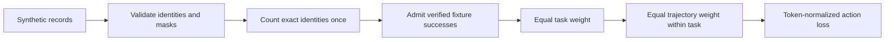

# Task-normalized action loss: a synthetic contract

**`training_ready = false`.** This small NumPy component checks a loss-weighting
contract with synthetic token identities. It supplies no model, tokenizer,
native trajectory, teacher output or repair evaluator. Passing its checks
establishes no competition score improvement or native compatibility.

## What receives weight?

For the distinct tasks with an accepted trajectory, the loss is:

```text
mean over tasks (
    mean over accepted successful trajectories for that task (
        mean negative log probability over that trajectory's action tokens
    )
)
```

Each task receives the same total weight. Within a task, each accepted trajectory
receives the same total weight. Within a trajectory, all action tokens share its
weight equally. A longer trajectory therefore has no extra total influence.
This is token normalization across the selected action tokens, not equal weight
per turn or per contiguous action span.



Prompt, thought and padding tokens have zero supervision. Failure, unknown
outcome and unverified success have zero supervision. Tasks without any admitted
success do not dilute the accepted tasks. An empty accepted set returns zero
loss and zero gradients; it is not evidence of a usable training batch.

## Run the existing checks

From this directory, using Python 3.10 or later:

```bash
python -m pip install -r requirements.txt
python -B -m unittest -v test_action_sft_loss
```

The recorded run used Python 3.12 and NumPy 2.2.6. The 17 existing checks passed
in 0.162 seconds wall time and 0.097 seconds child CPU time, including process
startup. The unittest runner reported 0.021 seconds internally. These are one
local measurement, not a throughput benchmark.

## Input and output contract

`FixtureTrajectory` holds canonical `fixture/task/...` and
`fixture/trajectory/...` identities, a nonempty one-dimensional integer
`token_ids` array, and aligned finite nonpositive floating `token_log_probs`.
The four aligned boolean masks—prompt, thought, action and padding—must form
a complete, disjoint partition. An accepted success requires an action token.
`outcome_provenance` must be `synthetic-fixture`; the explicit verification flag
is only fixture metadata.

`action_sft_loss(records)` returns scalar loss, per-record token weights,
gradients with respect to token log probabilities, accepted task/trajectory
counts, duplicate count and outcome exclusions. Returned arrays are read-only.
It is not a logits-gradient implementation or a model training loop.

Exact repeated records sharing the same canonical task/trajectory identity count
once, with later copies assigned zero weight. Conflicting copies raise an error.
The caller must establish canonical identity: aliases carrying newly invented
identities cannot be recognized automatically.

## Evidence and limits

The source, tests, protocol, pre-test freeze and validation receipt are retained
byte for byte. `SOURCE_FREEZE.json` also records a historical private quick-start
README hash; that historical document is outside this public packet. This README
is separate portable documentation. `PROVENANCE.json` identifies that distinction.

The checks include mass conservation, uneven trajectory lengths, duplicates,
outcome exclusions, malformed masks, conflicting identity, order invariance and
finite-difference gradients. They do not authenticate real outcome labels,
establish action masks from native token captures, or measure repair quality.
Any eventual training use requires those independent prerequisites and an
evaluation on untouched repositories. No research novelty is claimed.

Original component and documentation: MIT. NumPy is a separate dependency.
